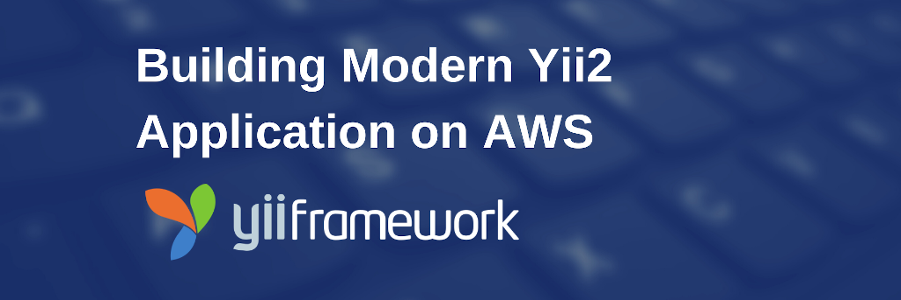

# Building Modern PHP/Yii2 Application using AWS

This repository contains sample of Yii2 application I created for my tutorial series: ["Building Modern PHP/Yii2 Application using AWS"](http://blog.petrabarus.net).



## Requirements

This is the list of softwares I used to develop the application

- *AWS CLI 1.16*
- *PHP 7.3*
- *Composer 1.19.1*
- *Node 10.16*
- *Node Package Manager 6.9.0*
- *AWS CDK 1.19*
- *Docker 19.03.5*
- *Docker Compose 1.25.1*

## Setting Up

Execute

```bash
./init.sh
```

## Running

### Running Locally

To run locally, you need to execute

```bash
docker-compose up
```

## Deploying

*WARNING*: Running this will incur you cost on provisioning on AWS. If you just want to try, don't forget to destroy the resources.

To deploy the code, you have to have AWS account and install your credentials on your local machine to run AWS CLI. After that execute this command.

```bash
cdk deploy
```

To delete all resources, execute.

```bash
cdk destroy
```